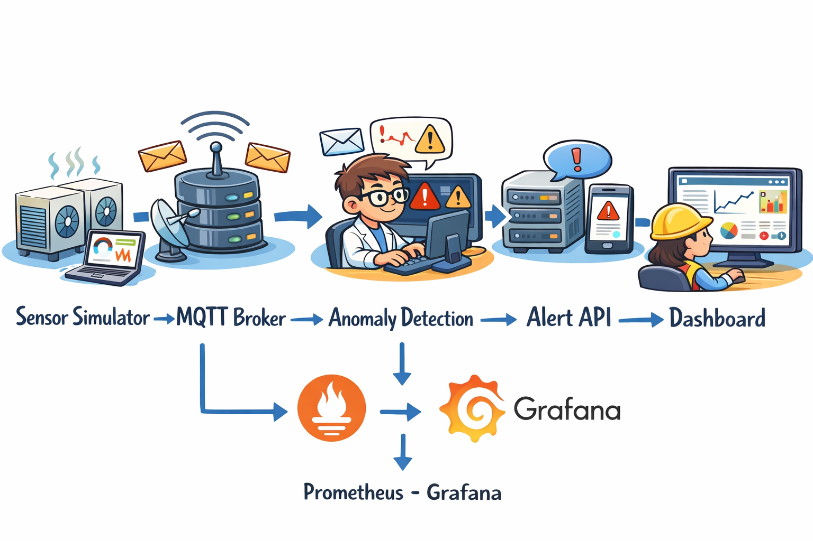

# 🔧 IoT Predictive Maintenance System

## 🚀 Overview
This project simulates a real-time IoT predictive maintenance system using MQTT, microservices, and a Streamlit dashboard.

It demonstrates an event-driven architecture similar to industrial systems

---

## 🧱 Architecture

Sensor Simulator → MQTT (Mosquitto) → Consumer → Flask API → Streamlit Dashboard
<p align="center">
  
</p>

---

## ⚙️ Tech Stack

- MQTT (Mosquitto)
- Python (Flask, Paho-MQTT)
- Streamlit (Dashboard)
- Docker & Docker Compose

---

## ▶️ How to Run

### 1. Clone repo

```bash
git clone https://github.com/YOUR_USERNAME/iot-predictive-maintenance.git
cd iot-predictive-maintenance
